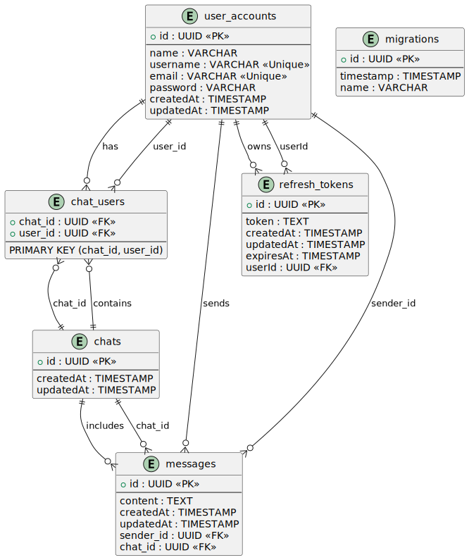

# Messenger App

## Introduction

This project is a simple messenger application, similar to Telegram, that allows users to communicate with each other via text messages. Users can find each other using unique nicknames. The application will be developed using a microservice architecture, with a backend written in Node.js, and a frontend built with React.js. Data will be stored in the cloud using PostgreSQL for user authentication and login data, and MongoDB for streaming user data, such as messages.

## Author

This project was developed by Illia Kornyk, a student of group IM-24 at NTUU KPI.

## Features

- User registration and authentication
- Find and connect with users by nickname
- Send and receive text messages
- Real-time messaging
- Cloud data storage for user information and messages

## Technology Stack

- **Frontend:** React.js
- **Backend:** Node.js
- **Databases:**
  - PostgreSQL (for user authentication)
  - MongoDB (for messages and streaming data)
- **Cloud Solutions:** [Heroku/AWS/GCP/DigitalOcean/etc.] (to be determined)
- **Containerization:** Docker

## Setup Instructions

### Prerequisites

- **Node.js** installed on your machine
- **MongoDB** (can be set up locally or run using Docker)
- **Docker** and **Docker Compose** installed (if using Docker, local installations are not required)

### Getting Started

1. **Clone the repository:**

   ```bash
   git clone <repository-url>
   ```

2. **Navigate to the project directory:**

   ```bash
   cd messenger-app
   ```

3. **Install dependencies**

   ```bash
   npm install
   ```

4. **Build the project**

   ```bash
   npm run build
   ```

5. **Start the project**

   ```bash
   npm run start:prod
   ```

#### Running the Application with Docker

The project can be set up and run using Docker

- Build and start the services:

  ```bash
  docker-compose up --build
  ```

- Stop the services:

  ```bash
  docker-compose down
  ```

- Access the Application:

  The backend services will be accessible at their respective ports as defined in the `docker-compose.yml` file.

  By default, the main service will be available at `http://localhost:3000`

### Deployed Version

The deployed version of this application can be found [here](https://messenger-api-2930.onrender.com/).

### API Documentation

#### Swagger

For testing and API documentation, Swagger is used. You can find the documentation at the endpoint `/docs`.

- [Swagger](https://messenger-api-2930.onrender.com/docs)

#### Postman

- [Postman flow](https://web.postman.co/workspace/e7b4d90b-5e29-44c8-8228-fb7b46bbfea0/flow/672a73b035ab526e247c29e4)

- [Postman collection](./assets/Messenger%20App.postman_collection.json)

## Usage

- Register: Users can create an account using their nickname.
- Find Users: Search for users by their nickname.
- Messaging: Send and receive messages in real time.

## Database Structure



### User Table (PostgreSQL):

- id: Unique identifier for each user.
- name: User’s name.
- email: User’s email address.
- password: Hashed password for user authentication.
- createdAt and updatedAt: Timestamps to track user creation and updates.

### Chat Collection (MongoDB):

- id: Unique identifier for each chat.
- usersIds: Array of user IDs representing the participants in the chat.
- createdAt and updatedAt: Timestamps to track when the chat was created and last updated.

### Message Collection (MongoDB):

- id: Unique identifier for each message.
- senderId: Reference to the id of the user who sent the message.
- receiverIds: Array of user IDs representing recipients of the message.
- content: The text content of the message.
- createdAt and updatedAt: Timestamps to track message creation and updates.

### Relationships

- User and Chat:
  A user can participate in multiple chats, and a chat must have at least one user.
- Chat and Message:
  Each chat can contain multiple messages, but each message belongs to only one chat.

## Future Improvements

- Implement message notifications
- Add support for multimedia messages (images, videos)
- Enhance user interface and user experience
